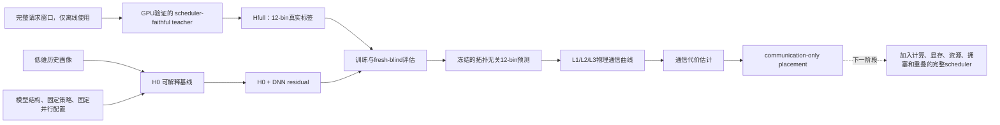

#### PatternDemand实验



- 背景：工作负载预测——>集群调度。在不知道一个待部署模型历史/未来完整请求列表的情况下，能否根据常态历史流量的低维画像、模型结构、固定执行策略和已经确定的并行配置，提前预测该模型推理会产生怎样的常态通信需求。【低维请求画像 → 12-bin 通信消息直方图】
  - 将通信需求表示为拓扑无关的12桶消息直方图。每个桶同时记录消息调用次数和逻辑通信字节数。预测器不直接预测延迟，预测结果回答“会产生多少条、什么大小的消息”，随后再把预测直方图代入候选拓扑层级对应的placement/topology的连续物理通信曲线，估算通信代价并进行不同部署方案的通信代价比较。
- 预测器：学习工作负载和执行语义产生的消息模式
  - 训练过程：
    - 训练集标签制作：
      1. 输入完整请求窗口。
      2. GPU验证 scheduler-faithful teacher：
         - 大规模训练标签不能全依赖真实GPU逐窗口运行，否则代价过高。实验采用两层证据：
           1. 用代表性GPU实验核对SGLang真实通信语义、scheduler行为、page/chunk预算、消息调用数和逻辑字节公式；
           2. 只有GPU trace与teacher逐请求、逐聚合、逐bin精确一致后，才允许teacher在CPU上批量生成大量Hfull标签。

         - teacher是经过GPU校准的scheduler-faithful离线执行器。（GPU真实跑6个模型验证`teacher` 的语义是否等价于真实 SGLang 通信事件，后续不再真跑模型生成训练标签，使用teacher代替）
           **补图**
      3. 使用 teacher 生成该窗口 $H_{full}$ 消息直方图（作为训练标签、真值）
         - Hfull用于训练和评估，但完整请求列表不进入最终预测器。最终预测器使用低维画像
    - 训练集输入制作：
      1. 完整请求列表抽取低维历史画像：**逻辑**
      2. 模型结构：**哪些结构**
      3. 固定TP/PP/PD配置:
         1. TP/PP 2/4/8
         2. PD: 1P1D
      4. 固定策略：**哪些策略**
  - 预测过程：
    - 输入：低维历史画像 + 模型结构 + 固定TP/PP配置 + 固定策略
    - H0结构预测 : 使用低维画像、模型结构和执行规则估计通信总量及分布。
    - DNN residual修正：H0+DNN residual，不让DNN从零预测全部通信，让DNN只学习H0没有解释好的剩余误差。保留结构先验，且允许DNN修正scheduler组批、策略切分和消息形状上的偏差。
      **todo**：补充TP / PP / PD预测精度展示
    - 输出：预测消息直方图 
      **todo补图**：12-bin 直方图实例图：我希望你给TP / PP / PD每个能搞两组图，每组三个画像区间，
      另每个图的桶分布不要特别集中，三个画像窗口需要反映三个流量画像的区别，第一组三张图的三个画像分布偏小、中、大消息区间，在横轴上的集中位置不同，第二组三张图三个桶的消息尺度分散程度不同，分别是非常分散，较为分散，和较为集中，来反映请求画像的消息分布宽度，你觉得呢，然后如果同一组三张图都没有出现的桶区间就不展示。
  - TP、PP和PD覆盖以下六个模型：
    1. `qwen3-8b`；
    2. `qwen3-30b-a3b`；
    3. `deepseek-v2-lite`；
    4. `llama-3.2-3b-instruct`；
    5. `qwen2.5-14b-instruct`；
    6. `mixtral-8x7b-instruct-v0.1`
- 物理曲线：描述给定机器、链路、primitive和placement下的传输代价；
  **todo补图**：**L1/L2/L3 物理通信曲线图**
  横轴为 payload size，纵轴为实测通信时间，分别展示 TP、PP、PD 的曲线。
- 调度器未来把通信代价与其他系统（资源余量、SM利用率）约束联合起来。


#### 杂项解释

1. PatternDemand 最终要学的是：低维请求画像 → 12-bin 通信消息直方图，但训练时需要标准答案，也就是每个窗口真实应该对应什么通信直方图。如果每个窗口都真实跑 GPU，成本太高，所以构造了三个离线 teacher。
2. Teacher 使用流程：先从真实流量里切出很多窗口。每个窗口保留完整请求列表，用于离线 teacher 根据完整请求列表算出 Hfull 标签。同一个窗口再提取低维画像，作为模型输入。用 `(低维画像 → Hfull 标签)` 训练 H0+DNN。盲测时，只给低维画像，先冻结预测，再打开 Hfull 标签评分。
   - teacher模拟器：
     1. 根据固定 SGLang 执行语义编写的 CPU 确定性模拟器：复现真实 SGLang 的通信生成规则
     2. GPU 只用来验证这个模拟器是否和真实 SGLang 通信事件一致；
     3. 验证通过后，训练集和盲测集的 Hfull 标签都由 CPU 批量生成。

```
请求长度 + 执行策略 + 模型结构
        ↓
teacher 模拟调度和通信事件
        ↓
计算消息 payload / logical bytes
        ↓
映射到 12-bin histogram
```

- 具体流程：
  - 预测时，调度系统只获得低维请求画像而非完整请求列表：请求数，输入/输出长度均值，输入/输出长度分布，预测系统先把低维画像还原成一个固定大小（32）的伪请求列表伪请求的输入长度、输出长度和组合比例，尽量匹配原画像中的统计特征。比如原画像显示：短输入请求占多数，输出普遍较短，少量请求较长。伪请求列表构造出类似的短、中、长请求比例。然后把这 32 个伪请求交给 teacher。
  - teacher 输入请求长度 + 执行策略 + 模型结构，生成 12-bin histogram，描述分桶消息直方图 /1000请求，作为H0。
    1. input_length：决定 TP prefill batch中token数，PP prefill event中 active token数，PD中P要向D发送多少KV page
    2. output_length：决定 TP decode 阶段每一步还有多少请求活跃；决定PP请求什么时候从 PP 流水线中移除；
    3. 请求顺序：FCFS 调度按照顺序接纳请求；不同顺序会改变 batch/chunk 切分；长请求出现的位置会影响后续请求；PP 中可能影响 lane 和 microbatch；PD 中可能影响 chunk 边界和 page 发送顺序。所以Hfull作为标签是包含历史画像完整的请求顺序的
    4. dtype：精度，计算KV bytes/token，bytes/page
    5. max batch size：一次batch最多多少请求
    6. max prefill tokens：一次prefill最多处理多少token

H0 表示仅根据低维画像恢复出的基础通信需求估计。伪请求列表由低维画像生成，丢失了真实窗口中的很多细节：比如精确请求顺序；极长请求的位置；真实 chunk 边界等，这个偏差由DNN来学习。

## 
